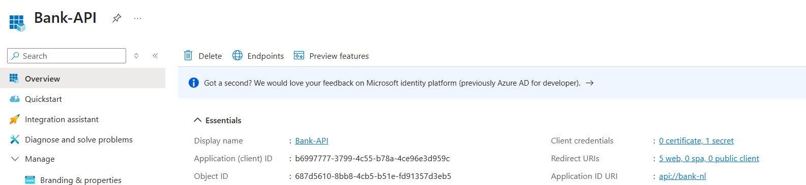
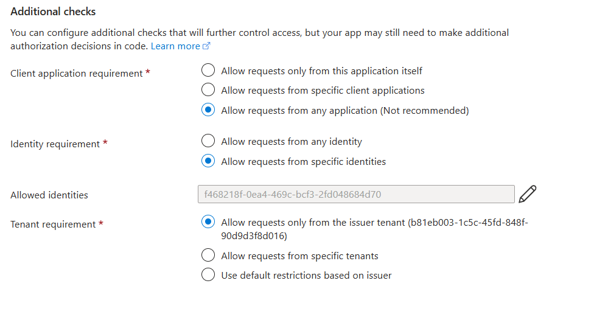
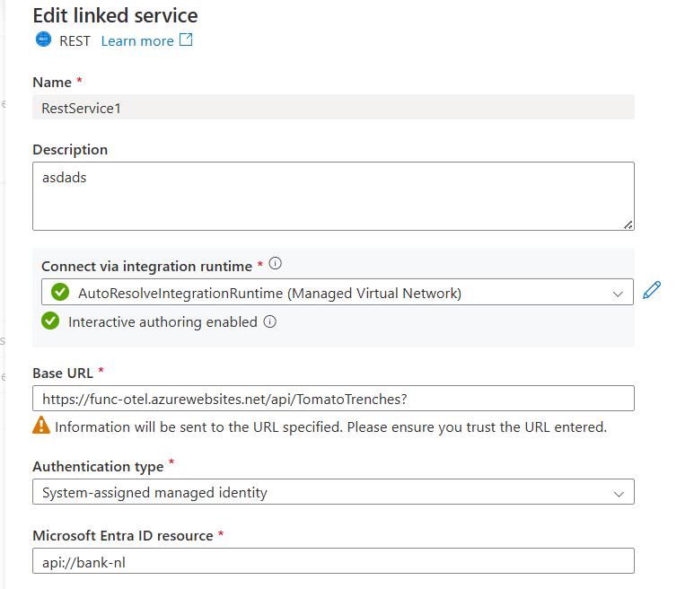
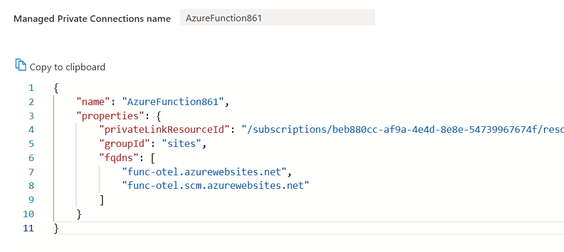
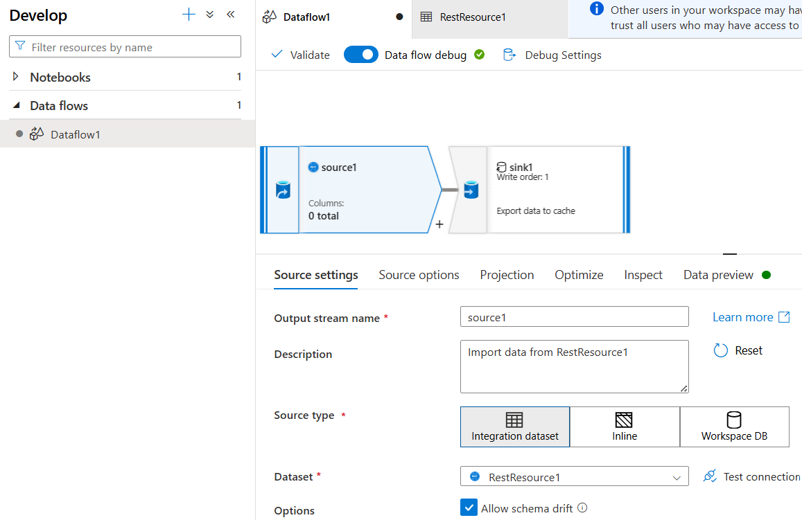
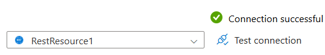

# Synapse DEP-enabled workspace with secure Azure Function calls via Data flows

[![CC BY-NC-SA 4.0][cc-by-nc-sa-shield]][cc-by-nc-sa]

[Data exfiltration protection for Azure Synapse Analytics workspaces (DEP)](https://docs.azure.cn/en-us/synapse-analytics/security/workspace-data-exfiltration-protection) blocks external calls, even when trying to get tokens with custom audience from your Entra ID tenant. This sample proves that it is possible to do some flexible calls to a Entra ID-secured Function App in a DEP-enabled workspace, with custom token audience, without the need of pipelines. 

## Reproduction steps

1. Create an Entra ID app registration. In this sample, the `Application ID URI` is `api://bank-nl`:

1. Create a Function App. In this sample, the app has the domain `func-otel.azurewebsites.net`. For demo purposes, add the following identity configuration to your Function App. The `Allowed identities` value is the `Object ID` of the system assigned identity of your Synapse resource in your tenant:

   

1. Create a `REST` linked service, pointing to your Function App (via the `Base URL`), and the Entra ID app registration (via the `Microsoft Entra ID resource`):

   

1. Create a managed private endpoint, pointing to the Function App. The `fqdns` must match the Function App domain(s):

   

1. Create `Data flow` with a [dataset](https://learn.microsoft.com/en-us/azure/data-factory/concepts-datasets-linked-services?tabs=data-factory) based of a `REST` store, and select the `REST` linked service you created earlier:

   

1. Finally, test your connection, this will actually use your system assigned identity and will attempt to call via your linked service:

   

## Why does this work? 

There are 2 points to notice:

1. Even though we're not using a Function App dataset, simply because that doesn't exist, it still matches your `REST` configuration with the managed private endpoint connection of your Function App. DEP will allow all connections that have managed private endpoints.
1. Because authentication is in context of the linked service, DEP will allow that.

## License

This work is licensed under a
[Creative Commons Attribution-NonCommercial-ShareAlike 4.0 International License][cc-by-nc-sa].

[![CC BY-NC-SA 4.0][cc-by-nc-sa-image]][cc-by-nc-sa]

[cc-by-nc-sa]: http://creativecommons.org/licenses/by-nc-sa/4.0/
[cc-by-nc-sa-image]: https://licensebuttons.net/l/by-nc-sa/4.0/88x31.png
[cc-by-nc-sa-shield]: https://img.shields.io/badge/License-CC%20BY--NC--SA%204.0-lightgrey.svg